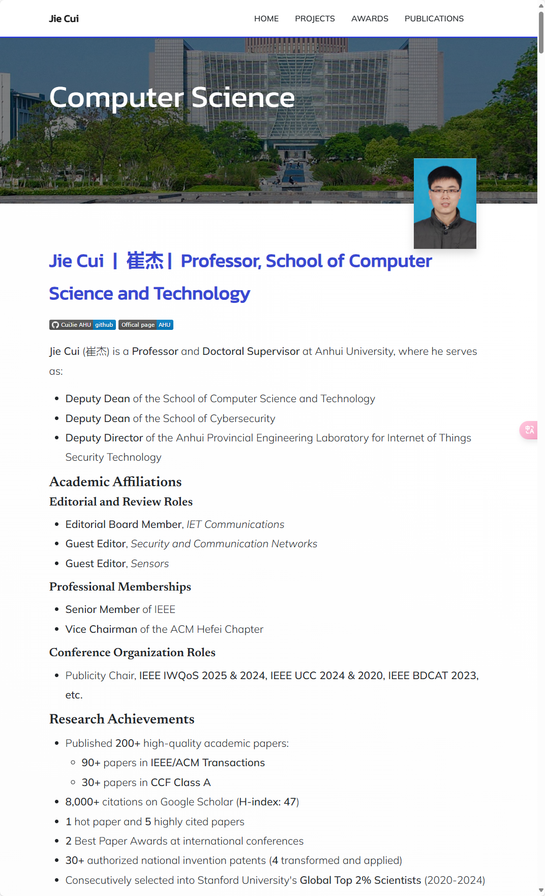

  

## Preview

**Jie Cui** (崔杰) is a **Professor** and **Doctoral Supervisor** at Anhui University, where he serves as:
- **Deputy Party Secretary** of the School of Computer Science and Technology
- **Deputy Dean** of the School of Cybersecurity
- **Deputy Director** of the Anhui Provincial Engineering Laboratory for Internet of Things Security Technology

### Academic Affiliations

#### Editorial and Review Roles
- Editorial Board Member, **IET Communications**
- Guest Editor, **Security and Communication Networks**
- Editorial Board Member/Guest Editor for four **SCI-indexed journals** (including *IET Communications* and *SCN*)

#### Professional Memberships
- **Senior Member** of IEEE
- **Vice Chairman** of the ACM Hefei Chapter

#### Conference Organization Roles
- Publicity Chair, **IEEE/ACM UCC 2020**

### Research Achievements
- Published **200+** high-quality academic papers:
  - **30+** papers in **CCF Class A** journals
  - **50+** papers in **IEEE/ACM Transactions**
- **8,000+** citations on Google Scholar (**H-index: 47**)
- **1** hot paper and **5** highly cited papers
- **2** Best Paper Awards at international conferences
- **30+** authorized national invention patents (**4** transformed and applied)
- Consecutively selected into Stanford University's **Global Top 2% Scientists** (2020-2024)

### Academic Excellence

Scientific Awards
- **Third Prize** of Anhui Provincial Natural Science Award (**2023**)
- **Second Prize** of Scientific and Technological Progress Award, Anhui Computer Federation (**2022**)
- **Second Prize** of Scientific and Technological Progress Award, Anhui Computer Federation (**2021**)

Anhui Provincial Teaching Achievement Awards:
- **First Prize** (**2022**)
- **First Prize** (**2021**)
- **Third Prize** (**2021**)

#### Email
cuijie@mail.ustc.edu.cn

#### Research Interests
- Vehicular network security 
- IoT security 
- Blockchain and cryptography 
- AI-driven security solutions 
- Digital twin security